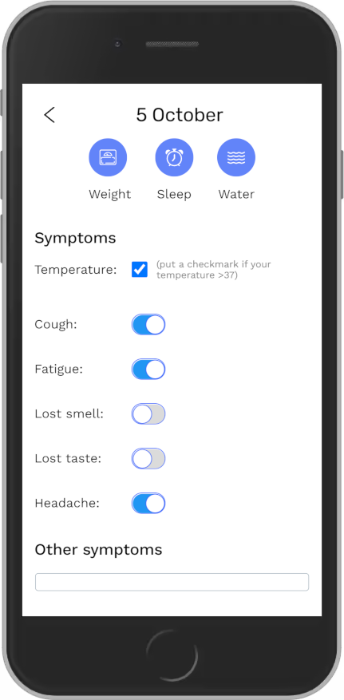

# CovTracker
A personal Covid-19 symptom tracker.

## Table of contents

- [Overview](#overview)
  - [The challenge](#the-challenge)
  - [Screenshot](#screenshot)
  - [Links](#links)
- [My process](#my-process)
  - [Built with](#built-with)
  - [What I learned](#what-i-learned)
  - [Continued development](#continued-development)
  - [Useful resources](#useful-resources)
- [Author](#author)

## Overview

### The challenge

Users should be able to:

- View the the app on a mobile device.
- See hover states for all interactive elements on the page when supported by the device.
- Add their symptoms on a daily basis.
- View all interactive elements on a popup panel.

### Screenshots

### Links

- [Live Site](https://synthetic-borealis.github.io/CovTracker/)
- [Github Repository](https://github.com/synthetic-borealis/CovTracker)

## My process

### Built with

- Semantic HTML5 markup
- CSS
- Flexbox
- Java Script
- BEM
- Mobile-first workflow

### What I learned

While working on this project we learned how some nifty UI tricks, such as how to create animated UI panels.

### Continued development

At some point in the future we'd like to convert this project to React (or a similar project), and perhaps turn it into a mobile application that can run outside of a browser.

### Useful resources

- [How to Create a Collapsible](https://www.w3schools.com/howto/howto_js_collapsible.asp) - This tutorial helped us a lot when it came to create the animated UI panels (with some adjustments to make it fit our needs for this project).
- [Vanilla Calendar](https://github.com/marssola/vanilla-calendar) - An open-source calendar library written in vanilla JavaScript & CSS that we initially planned to use in our project.

## Author

<b>Designer:</b> Mari Shinybekova 
<b>Programmers:</b> [Guy Gleb Kasner](https://github.com/Glebkas) & [Elhanan Flesch](https://github.com/synthetic-borealis) 
